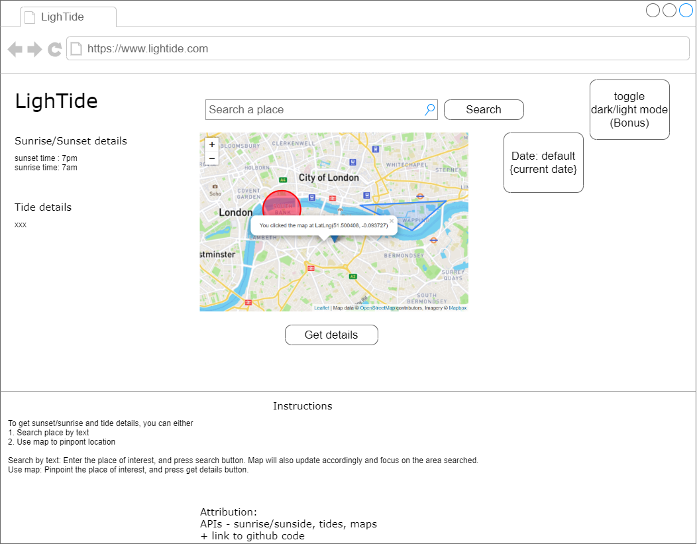

<!-- GA SEI 32 Project 2: FrontEnd with API -->
<!-- ZY, 1 Oct 2021 -->

# LighTide

Get sunset/sunrise details + tide details based on the selected position on the map.

## Description

My goal is to create an app which would be useful to researchers/scientists/hobbyists/trekkers/anyone who need information regarding sunlight/tides. Upon selecting a location on the map, the coordinates (lat/long) are parsed into the sunlight&tides API and users can see the results on screen.

Knowing the tides are essential to the safety of people going to the sea/ocean/etc, and having the knowledge of sunrise/sunset can help in planning for the activity.

### Technology Used
What technologies you used that helped you build this project. 

```

- React
```
<!-- - Bootstrap with react
- Ajax (axios) for API
- etc.. -->

### Wireframes

Your step by step planning sketch of your project, that you can post them as an image in here.


### User Stories


```
To use the app, user should:

- Click a point on the map / Search a place in search box
- Click registers a coordinate, gets a lat/long (useState)
- User confirms that is the point they are interested in, selects "get details" button
- Button will parse lat/long info into API, get the results and display on screen
- Bonus will be including a date selection so user can select the date they want and check the sunrise/tide information for that particular date

```

---

## Planning and Development Process
Plan:
App should have 3 useState, for sun/tide/map  
every click on map will update the coordinates for map (controlled input) [Forward geocoding]
1 useEffect, with 2 fetch API for sun/tide. changes the sun/tide state. On every [toggle], which is button click  


```
Timeline

30 Sept - look through the given APIs, selected the sunrise/sunset one. 
Couldn't find any on tides in the list so did own research and found one. 
Also decided to use the google maps one to incorporate my map.
1 Oct - Created readme and react app, started planning further details. 
Changed map API to geoapify/leaflet.
2 Oct - Test out sunrise/sunset API.
3 Oct - Test out tides API + geoapifymap API.
4 Oct - Exploring leaflet and testing out various maps with react. Installed react leaflet to experiment too.


```

### Problem-Solving Strategy

Google geocode API wasn't technically free since credit details were required.  
Had to research and switch to another geocode API, decided on geoapify.  
Realised that sunrise/sunset details could take in date from anytime, but tides only had a 10 day grace period.  


### Unsolved problems

List unsolved problems which would be fixed in future iterations.

## APIs Used

List your APIs you have used in this project and explain why did you use it.

Map API to get coordinates (lat/long)  
https://apidocs.geoapify.com/playground/geocoding  
https://leafletjs.com/examples/quick-start/  
Map static tiles API https://account.mapbox.com/  
Sunrise/sunset API https://sunrise-sunset.org/api  
Tides API https://docs.stormglass.io/#/  

---

## Acknowledgments


---

 ## References
Had to do some research to better understand the topic and here are some websites I visited:  

Read on tide details https://oceanservice.noaa.gov/education/tutorial_tides/tides05_lunarday.html  
Explore some lat/long coordinates https://www.satsig.net/maps/lat-long-finder.htm  
To hide API key https://stackoverflow.com/questions/48699820/how-do-i-hide-api-key-in-create-react-app  
Looking at space in URL https://stackoverflow.com/questions/13900835/the-origin-on-why-20-is-used-as-a-space-in-urls  
Leaflet https://leafletjs.com/examples/quick-start/  
React leaflet https://react-leaflet.js.org/  
