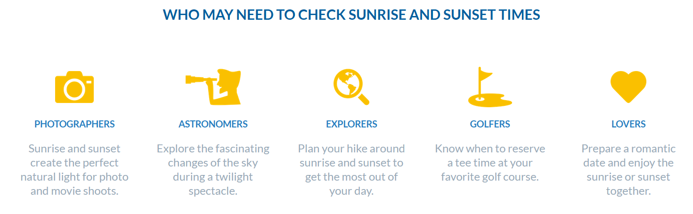
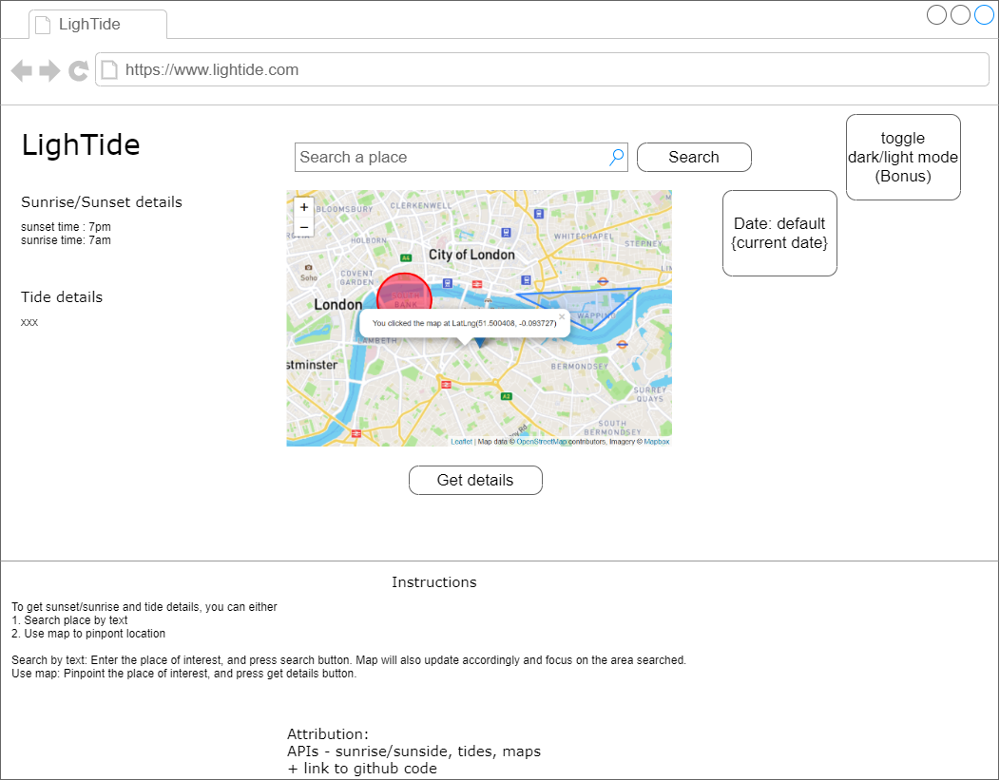

<!-- GA SEI 32 Project 2: FrontEnd with API -->
<!-- ZY, 1 Oct 2021 -->

# LighTide

Get sunset/sunrise details + tide details based on the selected position on the map.

##### Explore the app [here](https://lightide.vercel.app/)

## Description

My goal is to create an app which would be useful to researchers/scientists/hobbyists/trekkers/anyone who need information regarding sunlight/tides. Upon selecting a location on the map, the coordinates (lat/long) are parsed into the sunlight&tides API and users can see the results on screen.

Knowing the tides are essential to the safety of people going to the sea/ocean/etc, and having the knowledge of sunrise/sunset can help in planning for the activity.

Screenshot from https://sunrise-sunset.org/ suggesting who might require sunset/sunrise details


### Technology Used

Technologies used to build this project.

```
- React
- React Router
- Leaflet
- React-leaflet
- Openstreetmaps
- Axios
- Styled components CSS
- Date-fns
- Victory chart
```

### Wireframes



### User Stories

```
To use the app, user should:

- Click a point on the map / Search a place in search box
- Click / Search registers a coordinate, gets a lat/long
- User confirms that is the point they are interested in, selects "get details" button
- On click, button will parse lat/long info into API, get the results and display on screen
- Date selection included so user can select the date they want and check the sunrise/tide information for that particular date

```

---

## Planning and Development Process

```
Timeline

30 Sept 2021 - look through the given APIs, selected the sunrise/sunset one.
Couldn't find any on tides in the list so did own research and found one.
Also decided to use the google maps one to incorporate my map.

1 Oct 2021 - Created readme and react app, started planning further details.
Changed map API to geoapify/leaflet.

2 Oct 2021 - Test out sunrise/sunset API.

3 Oct 2021 - Test out tides API + geoapify map API.

4 Oct 2021 - Exploring leaflet and testing out various maps with react. Installed react leaflet to experiment too.

5 Oct 2021 - Added route/link and navbar, installed Axios and replaced fetch.
Added the search bar + submit button for the geoapify map search.

6 Oct 2021 - Added function to update the date state.
Adjusted leaflet map + explore leaflet marker.
Added get details button to retrive and update sun/tide details.
Successfully shifted Map from App to its own component.
Added Mapbox static tile layer.
Got the map to focus on position on searching a place. MVP Done!

7 Oct 2021 - Results now show in another page. "get details" changed from input to button type.
Installed styled components for CSS styling.

8 Oct 2021 - Added favicon and tested deployment.
CSS styling overhaul to make App look better.

9 Oct 2021 - Modified tide component to account for reaching daily tide limit.
Modified home page contents.

10 Oct 2021 - Edited home page contents for clarity.

11 Oct 2021 - Converted date/time from ISO format to local format for easier reading.
Added custom cursor.

12 Oct 2021 - Added dark mode to App.
Work on comments from soft launch (Sun code + URL useparams + chart + station marker)
Added marker on map to point out station.
Added redirect to homepage.

13 Oct 2021 - Tried to update map link on search, scraped efforts since results were not ideal.
Added chart to results, added button on home page, repositioned elements in results page.

14 Oct 2021 - Edited CSS for buttons to account for dark mode.
Edited chart aesthetics.
Modified some components to account for reaching daily tide limit.
Refactored and tidied up code.

15 Oct 2021 - Added border around tide data for better readability.
Added Datetimeformat component and edited code based on comment from presentation.

6 Dec 2021 - Upgraded react router dom to v6.
Fixed results route. Originally when a user keys in /results in their browser, website would just show a blank screen,
since there is no data set (i.e. no date/coordinates information).
Used conditional operator to fix this.
^ Didn't work as intended, undid the changes.
Also removed the datetimecomponent for the date in App.js since this causes the results page to not load once daily tide limit reached.

2 Jul 2023 - Prepare to upgrade react and react router dom to latest version.

3 Jul 2023 - Start react app from scratch again as libraries were too out of date and many were not compatible with each other.

4 Jul 2023 - Installed all required libraries, set up components folder and tested Attribute component. 

5 Jul 2023 - Tried to port over components from old project, but not everything works as intended.

6 Jul 2023 - Instead of reading react router dom documentations, will practice a sample project first before returning to this project. Many changes made to latest version of react router dom, and I would want to explore the new features first.

26 Jul 2023 - After going through tutorial, decide to restart whole project from scratch. 
Instead of only upgrading react router dom, might as well overhaul the app while I am working on it.
Added home component to App.js

27 Jul 2023 - Adjusted css for the dark mode to work.
Planning on looking at each components first before working to piece them together. 
Aiming to go in this order, from least dependencies to most dependencies and by logic:
-[x] Nav
-[x] Attribution
-[x] Home
-[ ] Maps
-[ ] Sun
-[ ] Tides
-[ ] Chart
-[ ] Datetimeformat

Adjusted attribution link colours.

28 Jul 2023 - Decided to challenge myself and add localisation during this overhaul.
Localisation:
-[ ] Nav
-[ ] Attribution
-[ ] Home
-[ ] Maps
-[ ] Sun
-[ ] Tides
-[ ] Chart
-[ ] Datetimeformat

```

### Problem-Solving Strategy

Tides date/time format was given in ISO format, had to use date-fns to convert to local time (object),
then format into string.

useParams/useRouteMatch were not helpful with the link updating, params was empty, while useRouteMatch
gave delayed response (2 clicks needed) which is same as current solution.  
Decided to ditch the map url update, doesn't work as intended.

react time series chart last update was in 2020, did not support current react version. Had to switch to Victory chart library, and create custom time series chart.

Chart title label color could not be changed directly, the dark grey font was hard to see in dark mode.
Managed to find a solution by adding a background style to the label.

### Unsolved problems

Search currently only accepts English, might add support for other languages.  
Tide API limit is 50 requests/day, too little...

## APIs / Acknowledgments

APIs

- Geocoding https://apidocs.geoapify.com/playground/geocoding
- Map static tiles https://www.mapbox.com/
- Sunrise/sunset https://sunrise-sunset.org/api
- Tides https://docs.stormglass.io/#/

npm Libraries

- React Router + React Router Dom
- Leaflet + React-leaflet
- Axios
- Styled components CSS
- Date-fns
- Victory chart

---

## References

Had to do some research to better understand the topic and here are some websites I visited:

Read on tide details https://oceanservice.noaa.gov/education/tutorial_tides/tides05_lunarday.html  
Explore some lat/long coordinates https://www.satsig.net/maps/lat-long-finder.htm  
To hide API key https://stackoverflow.com/questions/48699820/how-do-i-hide-api-key-in-create-react-app  
Looking at space in URL https://stackoverflow.com/questions/13900835/the-origin-on-why-20-is-used-as-a-space-in-urls  
Leaflet https://leafletjs.com/examples/quick-start/  
React leaflet https://react-leaflet.js.org/  
Registering an event on clicking map https://stackoverflow.com/questions/64937948/adding-onclick-function-to-a-mapcontainer-from-react-leaflet-in-typescript-f  
Getting map to flyto position on searching https://stackoverflow.com/questions/65979955/how-to-set-the-map-to-a-geolocation-on-map-load-with-react-leaflet-v3  
Styled components CSS https://styled-components.com/docs/basics#getting-started  
Styling Link https://stackoverflow.com/questions/37669391/how-to-get-rid-of-underline-for-link-component-of-react-router  
Favicon https://favicon.io/  
Eslint ignore file https://eslint.org/docs/user-guide/configuring/ignoring-code  
App deployment https://github.com/vercel/vercel/discussions/5566  
Media queries for styled components https://jsramblings.com/how-to-use-media-queries-with-styled-components/  
Adding local image https://stackoverflow.com/questions/34582405/react-wont-load-local-images  
Formatting date https://date-fns.org/v2.25.0/docs/format  
Idea for converting seconds to hours/mins/sec https://stackoverflow.com/questions/37096367/how-to-convert-seconds-to-minutes-and-hours-in-javascript  
Adding toggle with styled components https://codesandbox.io/s/6v7n1vr8yn?file=/src/index.js:149-287  
Editing class https://stackoverflow.com/questions/47706903/add-a-class-to-the-html-body-tag-with-react  
Dark mode with styled CSS https://dev.to/hyggedev/no-fuss-dark-mode-toggle-with-react-styled-components-3nd4  
useRouteMatch to replace useparams https://reactrouter.com/web/api/Hooks/useroutematch  
React Time series chart http://software.es.net/react-timeseries-charts/#/example/barchart  
Victory charts https://formidable.com/open-source/victory/  
Combining scatter & line plot https://omarshishani.medium.com/add-points-to-victoryline-chart-by-combining-with-scatter-plot-c56d663fbd35  
Time series with Victory chart https://medium.com/@michaelbush/using-formidables-victory-chart-library-to-display-data-changing-over-time-a6393a5cd87f  
Adding background to label https://formidable.com/open-source/victory/docs/new
